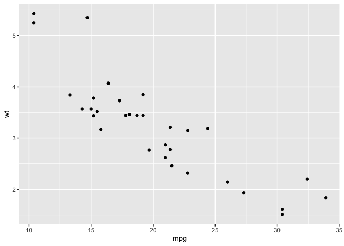

<!-- README.md is generated from README.Rmd. Please edit that file -->

``` r
library(dplyr)
```

    ## 
    ## Attaching package: 'dplyr'

    ## The following objects are masked from 'package:stats':
    ## 
    ##     filter, lag

    ## The following objects are masked from 'package:base':
    ## 
    ##     intersect, setdiff, setequal, union

``` r
library(ggplot2)
mtcars  %>% 
  ggplot(aes(x = mpg, y = wt)) +
  geom_point()
```

<!-- -->
